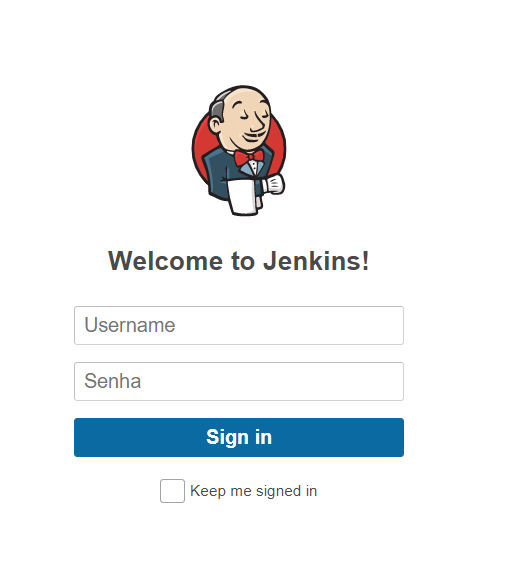
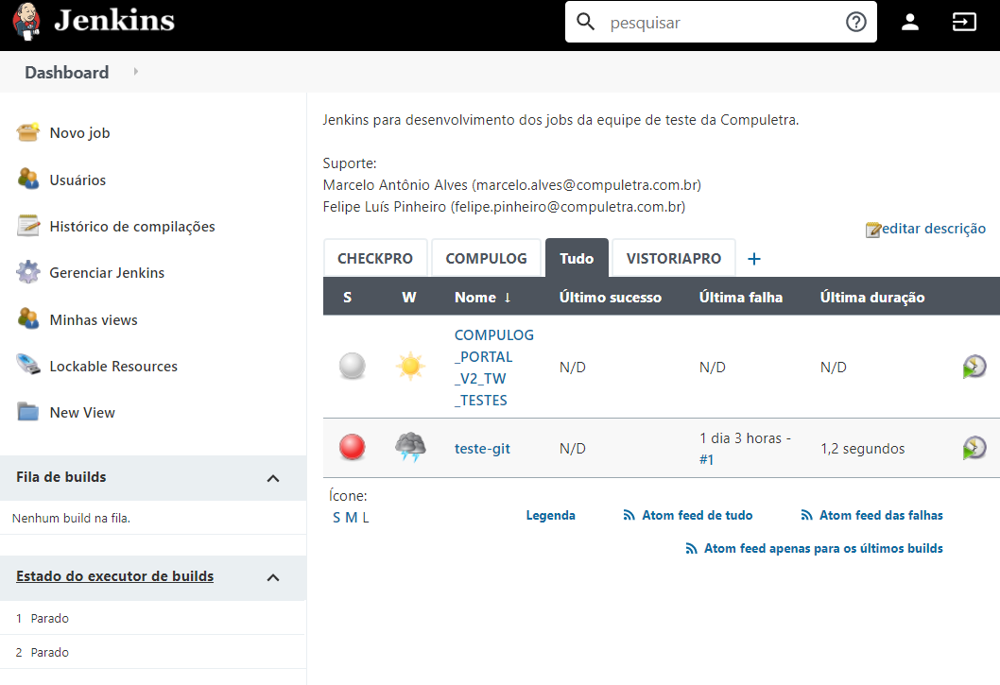
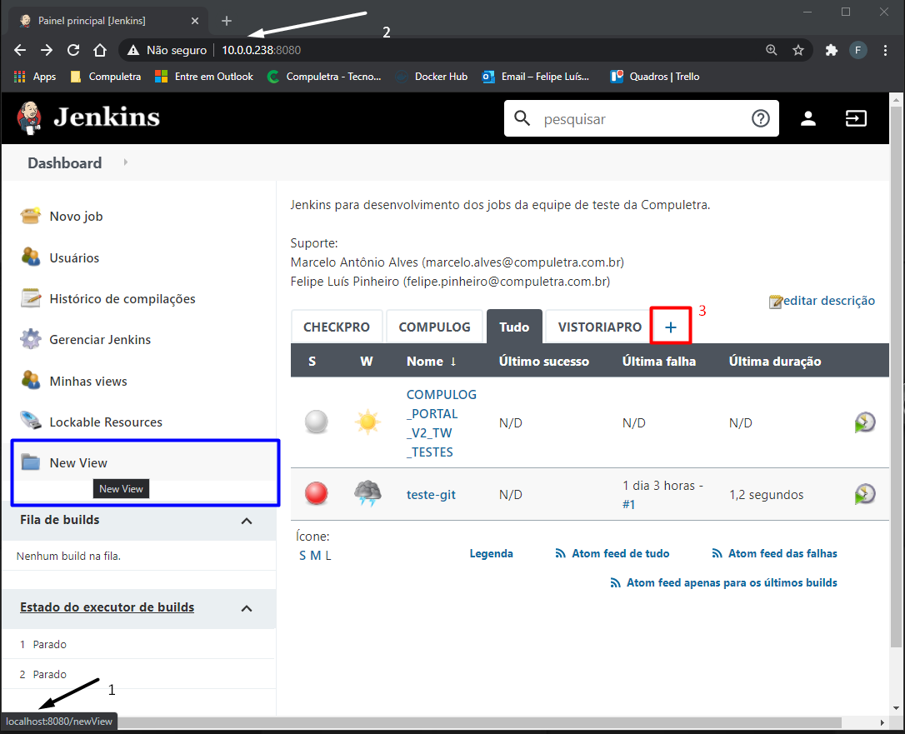
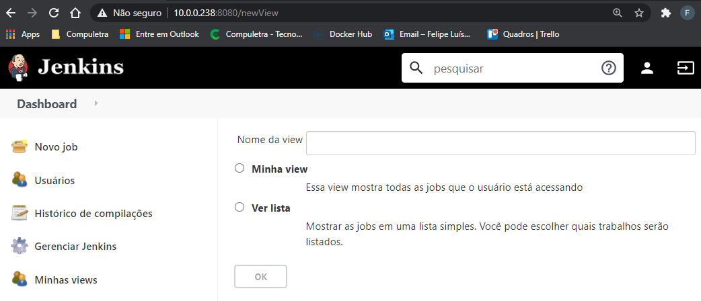
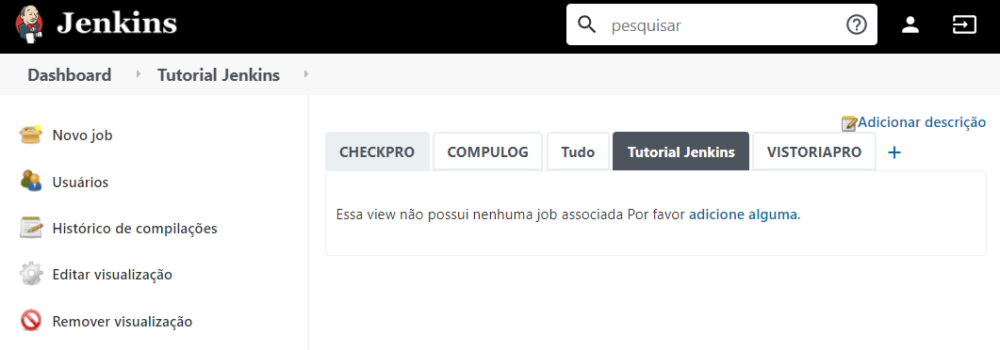
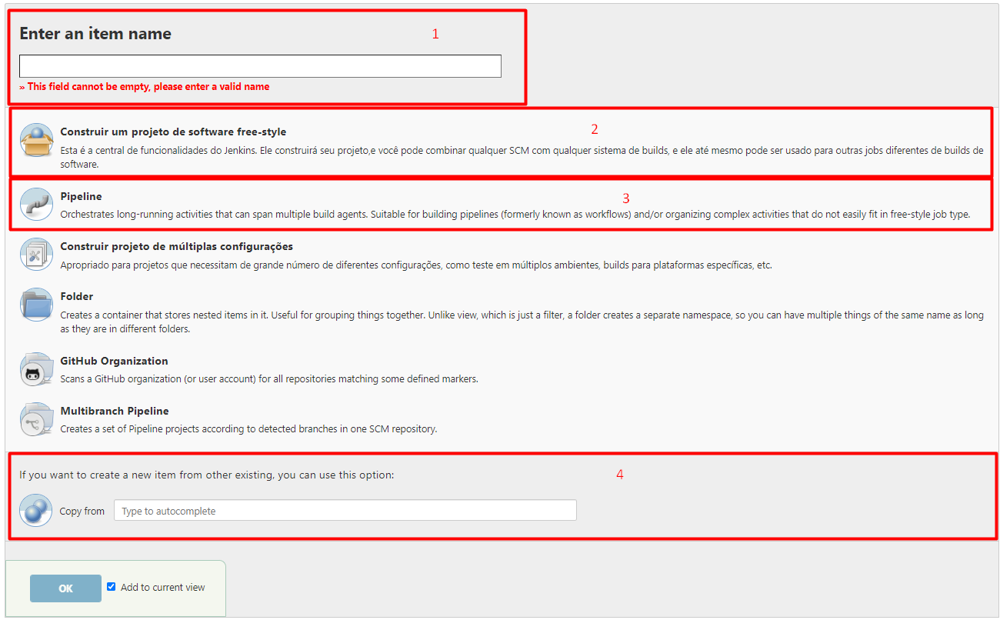
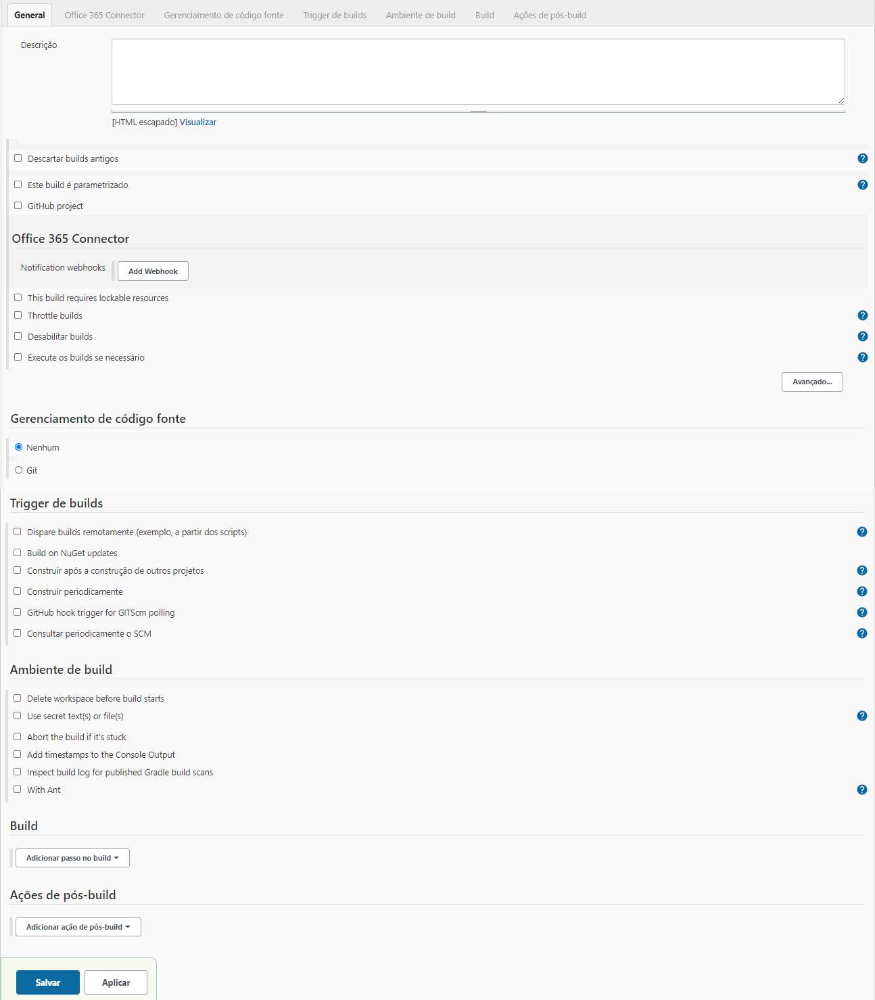
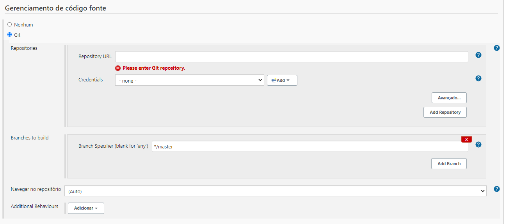

# Jenkins ambiente de test .Net 

Neste tutorial estamos interessados em criar um job no jenkins da equipe de testes da `Compuletra`.

## Acessando o ambiente

Primeiramente acessamos http://10.0.0.238:8080/ o qual nos levará para a seguinte tela de login

Após realizar o login, será redirecionado para a seguinte tela.

## criando View 

Iremos criar uma view para manter o nosso jobs organizados por grupo de trabalho, chamaremos essa view de `Tutorial Jenkins`, para tanto temos três opções o botão de + (marcado em vermelho), icone new view (que possui um bug de implementação), ou podemos simplesmente escrever no final da url `/newView` e dar enter, veja imagem abaixo.

Para esclarecer o bug do menu New View: O mouse foi colocado em cima do menu New View (quadrado azul), podemos ver em baixo na seta preta (item 1) que o link ao qual esse menu se refere é `http://localhost:8080/newView`, porém queremos ir para `http://10.0.0.238:8080/newView`

Basta escrever o nome da view `Tutorial Jenkins`, selecionar `ver lista` e clicar `ok`, você será redirecionada para outra página com opções avançadas da view, adicione uma descrição, se julgar necessário, e clique novamente em `ok` e pronto sua view foi criada com sucesso e a página inicial do jenkins deve aparecer assim.

observe que temos as opções de remover visualização, editar visualização.

## Criando Job novo

Para criar um job novo primeiramente devemos escolher a view na qual queremos que ele fique, no nosso caso a view `Tutorial Jenkins`, depois devemos clicar em `Novo job` e seremos redirecionado para a seguinte tela.

Item 1 - nome do job deve ser preenchido com o nome de sua escolha.

Item 2 - permite criar um job do tipo free-style

Item  3 - permite criar um job do tipo pipeline

Item 4 - Faz uma copia de um job já existente

preecha obrigatoriamente o  Item 1.

Depois selecione o item 2, ou o item 3 e clique em ok e seu job foi criado totalmente em branco. 

ou preencha o item 4 com um nome de um job préviamente existente e clique em ok, pronto seu job foi criado exatamente igual ao job anterior.

### Free Style 

Abaixo podemos ver a tela do job `Free-style`

Este tipo de job é baseado em plugin e funcionalidades externas que podem ser instalados ao jenkins.

Neste tipo de projeto os principais itens são:

* Gerenciamento de Código Fonte

Aqui se define qual é o repositorio a ser utilizado pelo job e qual é a credencial de acesso ao repositorio caso ele seja um repositorio privado.

Também podemos definir em qual branch que deve ser feito o build.

* Build